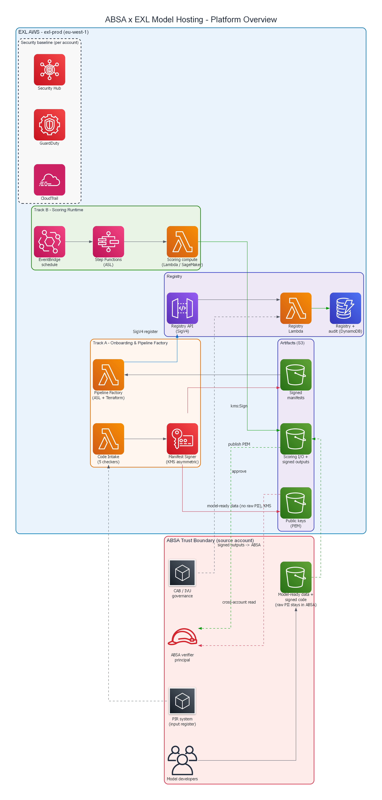
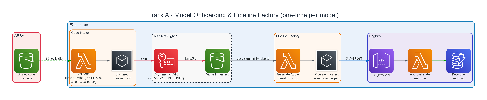
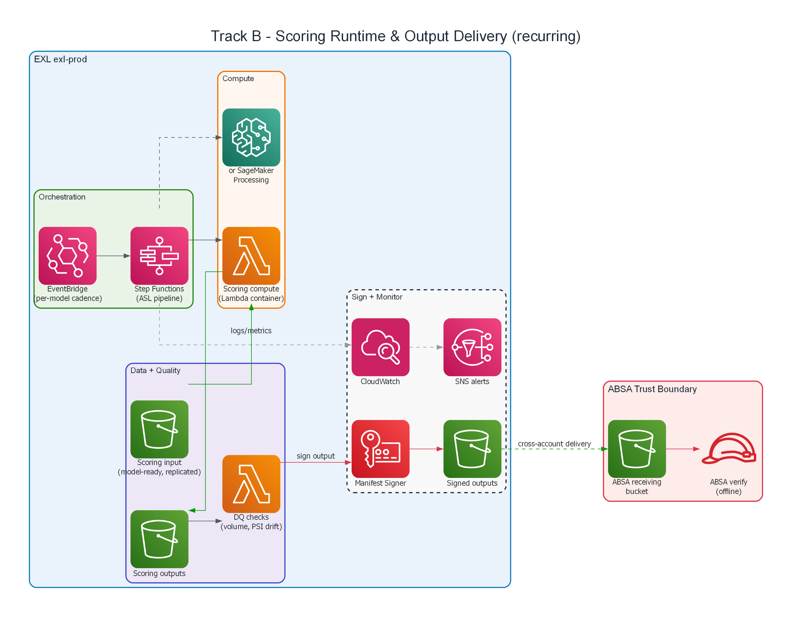
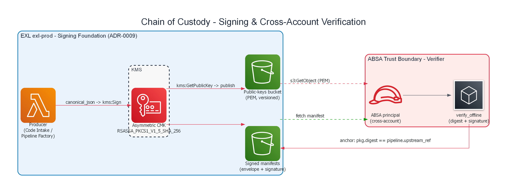
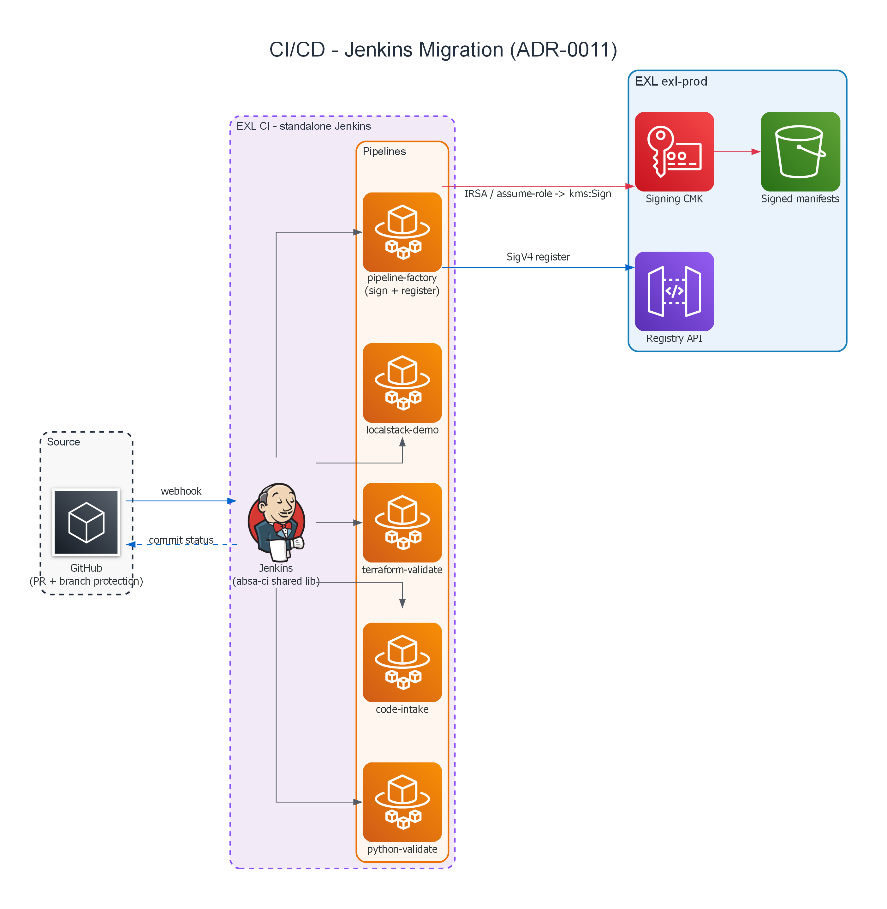
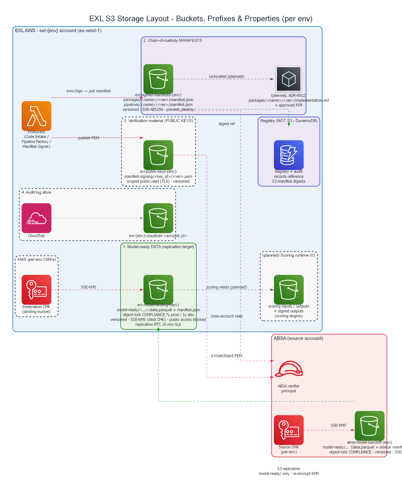

# AWS Architecture Diagrams

AWS architecture diagrams for the ABSA × EXL Model Hosting platform, rendered
with the [`diagrams`](https://diagrams.mingrammer.com/) library (graphviz
backend). Six focused sections rather than one unreadable mega-diagram.

**Regenerate:** `uv run --with diagrams python scripts/build_aws_diagrams.py`
(requires graphviz `dot` on PATH). The script is the source of truth — edit it,
don't hand-edit the PNGs.

## Edge legend

| Colour | Meaning |
|---|---|
| Blue | HTTPS / API (SigV4, webhooks, commit status) |
| Green | Data access / movement (S3 replication, scoring I/O) |
| Red | Signing / verification / security (KMS, cross-account verify) |
| Gray | Internal / default connections |
| Dashed | Replication, monitoring, or asynchronous flows |

Cluster colours: **red-tint = ABSA trust boundary**, **blue-tint = EXL AWS
account**, with orange (onboarding), green (scoring), purple (data/registry),
and dashed-grey (security baseline) sub-groups.

---

## 1. Platform Overview

The cross-account topology: ABSA's trust boundary (source data, signed code
packages, PIR, CAB/IVU governance, the ABSA verifier principal) and the EXL
`exl-prod` account hosting the platform — Track A (onboarding), Track B
(scoring), the registry, the S3 artifact buckets, and the per-account security
baseline. Boundary-crossing flows: data replication in, signed outputs out,
public-key publish + cross-account verify.

## 2. Track A — Model Onboarding & Pipeline Factory

The one-time-per-model producer chain: ABSA signed package → **Code Intake**
(5 checkers) → unsigned manifest → **Manifest Signer** (KMS asymmetric
`kms:Sign`) → signed manifest in S3 → **Pipeline Factory** (renders ASL +
Terraform, links upstream by digest) → **Registry API** (SigV4) → record +
audit log in DynamoDB.

## 3. Track B — Scoring Runtime & Output Delivery

The recurring scoring flow: **EventBridge** (per-model cadence) → **Step
Functions** (ASL) → **scoring compute** (Lambda container or SageMaker
Processing) over replicated input → **DQ checks** (volume, PSI drift) →
**Manifest Signer** signs the output → signed outputs delivered cross-account
to ABSA's receiving bucket → ABSA verifies offline. CloudWatch + SNS handle
monitoring and alerting.

## 4. Chain of Custody — Signing & Cross-Account Verification

The platform's signature guarantee (ADR-0009): a producer canonicalises the
payload and calls `kms:Sign` on the asymmetric CMK
(`RSASSA_PKCS1_V1_5_SHA_256`); the public key is published (PEM) to a
cross-account-readable S3 bucket; ABSA's principal fetches the manifest + PEM
and runs `verify_offline`. The digest anchor (`package.digest ==
pipeline.upstream_ref`) ties the chain together end-to-end.

## 5. CI/CD — Jenkins Migration (ADR-0011)

The CI layer being migrated from GitHub Actions to EXL's standalone Jenkins:
GitHub PR webhooks trigger Jenkins (the `absa-ci` shared library); five
pipelines (python-validate, code-intake, terraform-validate, localstack-demo,
pipeline-factory) run; the AWS-touching `pipeline-factory` job authenticates
via IRSA / assume-role to `kms:Sign` and SigV4-register. Commit statuses flow
back to GitHub branch protection.

## 6. S3 Storage Layout — Buckets, Prefixes & Properties

How artifacts are stored in each EXL env account once they land (ADR-0001,
ADR-0009, ADR-0010). Four built buckets, each scoped to one artifact kind:

- **`exl-model-landing-{env}`** — the replication target for ABSA's model-ready
  data (`model-ready/<…>/data.parquet` + sidecar `manifest.json`). Object-lock
  COMPLIANCE (7y prod / 1y dev), versioned, SSE-KMS with the per-env destination
  CMK, public access blocked, 15-min RTC SLA. **Raw PII never crosses** — only
  model-ready data does.
- **`exl-signed-manifests-{env}`** — the chain-of-custody anchor, keyed by
  subject type: `packages/<name>/<ver>/manifest.json` and
  `pipelines/<name>/<ver>/manifest.json`. Versioned, SSE-AES256,
  `prevent_destroy`; ABSA verifier principals get cross-account read.
- **`exl-public-keys-{env}`** — signing public keys at
  `manifest-signing/<key_id>/<ver>.pem`; the one bucket with scoped public read
  (TLS-only) so anyone can verify a signature offline.
- **`exl-{env}-cloudtrail-<account_id>`** — the audit log store.

Two clarifications the diagram makes explicit: the **registry is DynamoDB, not
S3** (it stores records that *reference* the S3 manifest digests); and the
**scoring runtime I/O** prefixes plus the IDG `implementation.md` location are
**planned** (scoring engine + ADR-0012), not yet built.

---

## Notes

- These reflect the **target real-AWS architecture**. Today the platform runs
  the same chain against **LocalStack** (`make demo`); only the endpoints and
  the boto3 session shape change for real AWS — see
  [docs/phase-3-closeout.md](../phase-3-closeout.md).
- The compute tier (Lambda container vs SageMaker Processing) is the open
  **D04** decision — both are shown in Track B.
- For an editable / draw.io version, the `diagrams`-script source can be
  translated to draw.io XML on request; the PNGs here are regenerated from code.
