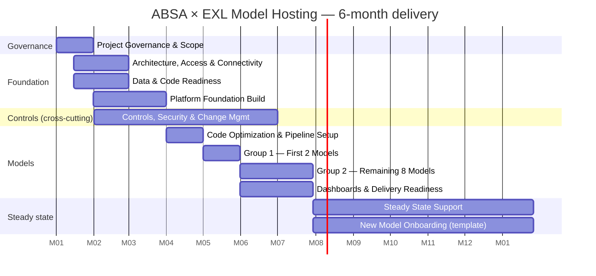
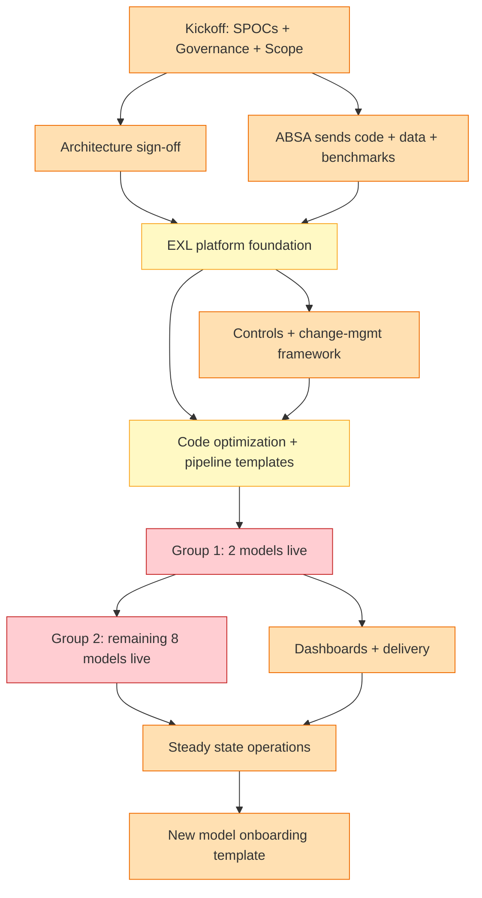
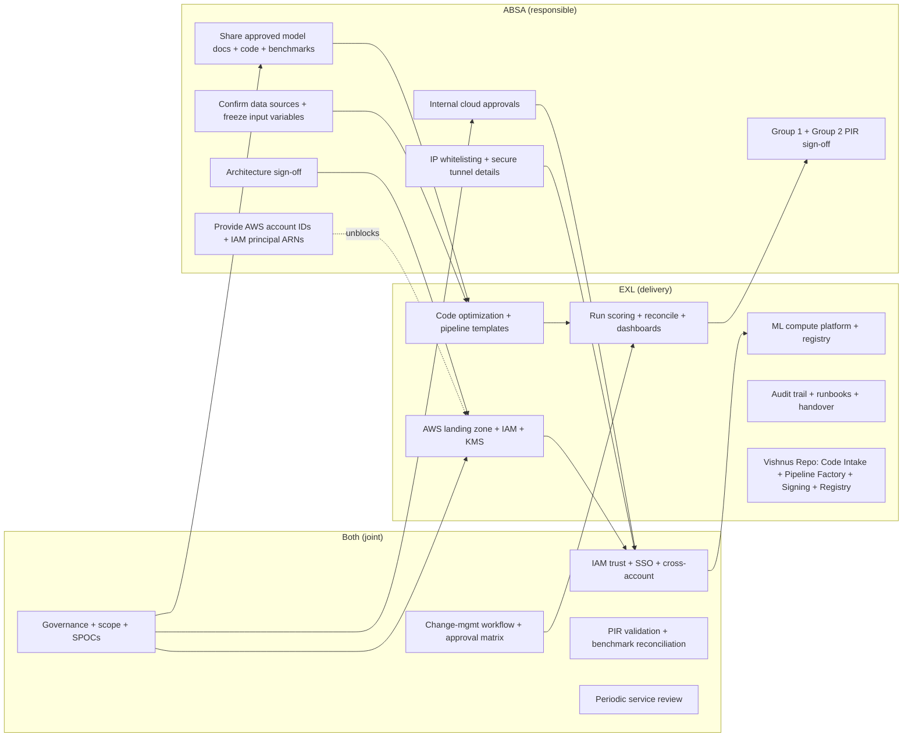

# ABSA × EXL Model Hosting — End-to-End Program Flow

> Reading order for a techno-functional reviewer: §1 high-level Gantt → §2 critical-path flowchart → §3 swim lanes → §4 phase-by-phase detail.
>
> **Legend (delivery status):** ✅ delivered in this repo · 🟡 partial / scaffolding only · ⏳ planned, not started · ⚠️ blocked on ABSA input

---

## 1. Timeline at a glance

## 2. Critical-path flow

**Critical path:** kickoff → architecture sign-off → platform build → code optimization → Group 1 PIR sign-off → Group 2 onboarding → steady state. Two parallel feeders (data readiness, controls) gate platform build and code optimization respectively.

## 3. Ownership swim lanes

## 4. Phase-by-phase detail

### Phase 1 (Month 1) — Project Governance & Scope

| Task | Owner | Status | Notes |
|---|---|---|---|
| Confirm kickoff agenda + stakeholder list | BOTH | ⏳ | Kickoff meeting |
| SPOCs from ABSA and EXL | BOTH | ⏳ | Single points of contact each side |
| Finalize governance structure + cadence | BOTH | ⏳ | Weekly standup + monthly steering |
| Review scope, exclusions, assumptions, dependencies | BOTH | ⏳ | RACI + dependency log |
| Agree delivery plan for the initial 10 models | BOTH | ⏳ | Sequencing: Group 1 (2) → Group 2 (8) |
| Confirm run frequency per model | BOTH | ⏳ | Daily / weekly / monthly cadence |
| Share approved model docs (initial set) | ABSA | ⏳ | Model dev specs, validation reports |
| Share code + supporting artefacts + benchmark outputs | ABSA | ⏳ | Reference golden data for reconciliation |
| Agree PIR expectations + sign-off checkpoints | BOTH | ⏳ | Post-Implementation Review framework |
| Create project logger | EXL | ⏳ | Jira/Confluence/equivalent |

**Gate to next phase:** all SPOCs identified, scope sign-off, initial 10-model list locked.

---

### Phase 2 (Month 1-2) — Architecture, Access & Connectivity

Runs in parallel with Data & Code Readiness (Phase 3).

| Task | Owner | Status | Notes |
|---|---|---|---|
| Review target architecture + secure transfer approach | BOTH | ✅ | ADRs 0001-0010 capture decisions |
| Approve final architecture for implementation | ABSA | ⚠️ | Awaits ABSA sign-off |
| Complete ABSA internal cloud approvals | ABSA | ⚠️ | ABSA-side governance |
| Provision EXL AWS landing zone accounts + baseline access | EXL | 🟡 | Terraform modules ready (`terraform/account-bootstrap/`); awaits real account IDs |
| Set up IAM trust for cross-account connectivity | BOTH | 🟡 | `signing-foundation` module wires policy; awaits ABSA principal ARNs |
| Complete IP whitelisting for approved endpoints | ABSA | ⚠️ | ABSA-side firewall rules |
| Share secure tunnel and connectivity details | ABSA | ⚠️ | VPC peering / Transit Gateway / PrivateLink decision |
| Configure encrypted S3 replication path | BOTH | 🟡 | `terraform/modules/s3-replication-{source,destination}` ready |
| Validate end-to-end encrypted transfer | BOTH | ⏳ | Real-account test once accounts onboard |
| Finalize domain mapping for access endpoints | BOTH | ⏳ | DNS/Route 53 plan |
| Configure SSO federation | BOTH | ⏳ | Identity provider integration |
| Joint SSO testing + sign-off | BOTH | ⏳ | After Phase 2 dependencies clear |

**What's in the repo today:**
- Terraform modules: `landing-zone`, `iam-federation`, `kms-hierarchy`, `s3-replication-source`, `s3-replication-destination`, `signing-foundation`, `pipeline-registry`
- Per-env stacks: `terraform/envs/{dev,stg,prod}/{source,destination,signing,registry}`
- Account bootstrap: `terraform/account-bootstrap/{exl-dev,exl-stg,exl-prod}`

---

### Phase 3 (Month 1-2) — Data & Code Readiness

Runs in parallel with Architecture (Phase 2).

| Task | Owner | Status | Notes |
|---|---|---|---|
| Confirm source datasets + file structure per model | ABSA | ⚠️ | Per-model data dictionary |
| Freeze input variables + requirements (initial set) | ABSA | ⚠️ | PIR mapping authority |
| Provide access to original dev environment | ABSA | ⚠️ | For code optimization phase |
| Prepare scoring-ready data at agreed cadence | EXL (ABSA-side) | ⏳ | EXL operates inside ABSA's data plane |
| Prepare signed code package + documentation | ABSA | ⚠️ | Package contract spec is in repo (ADR-0010) |
| Transfer scoring-ready data, code, benchmarks to EXL | ABSA | ⚠️ | Cross-account S3 replication path |
| Validate receipt, completeness, integrity (**Vishnu's Repo**) | EXL | ✅ | **`code-intake validate`** checks SAS, Python, schema, tests, PIR |
| Run data-quality checks: schema, volume, drift (**Vishnu's Repo**) | EXL | 🟡 | Schema + PIR coverage ✅; volume + drift checks ⏳ |
| Review and resolve intake issues | BOTH | ⏳ | Triage process for each model |

**What's in the repo today:**
- `code-intake/` workspace member with 5 checkers (`static_python`, `static_sas`, `schema`, `tests`, `pir`)
- Per-package venv isolation (Phase 3 Sprint 2): each package declares deps in `python/pyproject.toml`
- Stricter PIR extraction handling f-strings + variable column names
- Finding codes: PY001-998, SAS002-003, SCH001-003, TST001-998, PIR001-002
- Worked example: `packages/credit-risk-pd/1.0.0/` with full structure

---

### Phase 4 (Month 2-3) — Platform Foundation Build

Gated on architecture sign-off (Phase 2) + governance lock (Phase 1).

| Task | Owner | Status | Notes |
|---|---|---|---|
| Build AWS landing zone + core networking | EXL | 🟡 | Modules ready; apply on real accounts pending ABSA |
| Configure IAM roles + KMS keys + secrets | EXL | 🟡 | `signing-foundation` module ready; per-env stacks for dev/stg/prod |
| Set up ML compute platform | EXL | ⏳ | Choice: Step Functions + Lambda vs SageMaker pipelines (Phase 3 deferral) |
| Create model registry + version control | EXL | ✅ | `registry-api` FastAPI app + DynamoDB table + Pydantic schemas |
| Set up feature metadata + lineage capture | EXL | 🟡 | PIR captures input lineage; output lineage TBD |
| Set up CI/CD pipelines for deployment + rollback | EXL | 🟡 | GH Actions workflows for sign / publish / drift-check; rollback via signed manifest version history |
| Create infrastructure-as-code templates | EXL | ✅ | All Terraform modules + per-env stacks in `terraform/` |
| Set up observability + logging + alerts (**Vishnu's Repo**) | EXL | 🟡 | Audit emission ✅ (Phase 2 Sprint 1 T8); dashboards ⏳ |
| Set up audit trail + evidence capture | EXL | ✅ | `registry-api` emits append-only audit events on every state change |
| Validate platform readiness vs security controls (**Vishnu's Repo**) | BOTH | ✅ | `docs/compliance/control-matrix.md` maps ADRs to ISO 27001 + SOC2 |

**What's in the repo today:**
- `pipeline-factory/` — deterministic ASL + Terraform stub generator
- `manifest-signer/` — KMS asymmetric signer with chain-of-custody
- `registry-api/` — FastAPI registry with approval state machine
- `code-intake/` — package validator
- `infra/localstack/` — full LocalStack-based demo of the chain (Phase 3 Sprint 1)

---

### Phase 5 (Month 2-6) — Controls, Security & Change Management

Cross-cutting, runs across 5 months.

| Task | Owner | Status | Notes |
|---|---|---|---|
| Define change-request workflow + approval matrix | BOTH | 🟡 | Registry's approval state machine (`registry-api/transitions.py`) is the technical surface |
| Review process for medium/high-risk changes (**Vishnu's Repo**) | BOTH | 🟡 | `registry-api` approve/retire routes + audit log |
| Define peer review + promotion gates for prod | BOTH | ✅ | GH branch protection + drift gates + `localstack-demo` CI |
| Document rollback requirements | EXL | 🟡 | Runbook structure exists; per-model rollback procedures TBD |
| Set up release logging | EXL | ✅ | Audit log via `registry-api` |
| Confirm data retention + archival rules | BOTH | ⏳ | Lifecycle policies on S3 buckets |
| Confirm secure access controls for dashboard endpoints | BOTH | ⏳ | After dashboard build (Phase 8) |

**Key deliverable already in repo:** `docs/runbooks/kms-key-rotation.md` (Phase 3 Sprint 3) covers the day-2 ops procedure for the signing CMK.

---

### Phase 6 (Month 3-4) — Code Optimization & Pipeline Setup

Gated on platform build (Phase 4) + initial data/code transfer (Phase 3).

| Task | Owner | Status | Notes |
|---|---|---|---|
| Review developer code for production readiness | EXL | 🟡 | Per-package `code-intake validate --strict` |
| Standardize + optimize model scoring code | EXL | ⏳ | Per-package work; uses dev environment access from Phase 3 |
| Validate scoring logic vs dev benchmarks | BOTH | ⏳ | Reconciliation framework |
| Package scoring code for controlled deployment | EXL | ✅ | Package contract spec (ADR-0010); each package signed via `manifest-signer` |
| Create reusable scoring pipeline templates | EXL | ✅ | `pipeline-factory` standard-batch + scalable-batch + realtime-placeholder ASL templates |
| Register models + pipeline versions in registry | EXL | ✅ | `register-pipeline` CLI (SigV4 → `/models` POST) |
| Set up model run schedules | BOTH | ⏳ | EventBridge schedules; depends on cadence locked in Phase 1 |
| Complete code intake validation + metadata capture (**Vishnu's Repo**) | EXL | ✅ | `code-intake generate-manifest` produces signed package manifest |

---

### Phase 7 (Month 4) — Group 1 (First 2 Models)

The first proof point. Gated on code optimization (Phase 6).

| Task | Owner | Status | Notes |
|---|---|---|---|
| Prepare Group 1 onboarding plan | EXL | ⏳ | Per-model checklist |
| Run initial scoring for Group 1 models | EXL | ⚠️ | Needs real ABSA accounts + data |
| Reconcile Group 1 outputs with benchmarks | BOTH | ⚠️ | Byte/value comparison vs ABSA-provided golden |
| Resolve defects in initial output testing | BOTH | ⏳ | Defect log + retest cadence |
| Complete PIR for Group 1 | BOTH | ⏳ | Post-Implementation Review |
| Obtain Group 1 sign-off | ABSA | ⚠️ | Gates Group 2 |

**Critical gate:** Group 1 sign-off is the program's biggest single milestone. Until then, Group 2 stays paused.

---

### Phase 8 (Month 5-6) — Group 2 + Dashboards

Two parallel workstreams; Group 2 gated on Group 1 sign-off (Phase 7).

#### 8a. Remaining 8 Models (Group 2)

| Task | Owner | Status | Notes |
|---|---|---|---|
| Prepare Group 2 onboarding plan | EXL | ⏳ | Reuses Group 1 lessons + pipeline templates |
| Run onboarding + scoring for Group 2 | EXL | ⏳ | Each model uses standard-batch / scalable-batch template |
| Reconcile Group 2 outputs with benchmarks | BOTH | ⏳ | Same framework as Group 1 |
| Resolve defects | BOTH | ⏳ |
| Complete PIR for Group 2 | BOTH | ⏳ |
| Obtain Group 2 sign-off | ABSA | ⏳ | Closes initial-onboarding program scope |

#### 8b. Dashboards, Alerts & Delivery

| Task | Owner | Status | Notes |
|---|---|---|---|
| Agree dashboard views, recipients, access levels | BOTH | ⏳ | Who sees what, when |
| Build monitoring dashboard for runs + exceptions | EXL | ⏳ | CloudWatch + Grafana or equivalent |
| Configure notifications + alert routing | BOTH | ⏳ | SNS / PagerDuty / Slack |
| Validate dashboard for inputs, outputs, failures | BOTH | ⏳ |
| Set up secure output delivery to ABSA | EXL | 🟡 | S3 replication path from `s3-replication-destination` module |
| Confirm operational runbooks + support contacts | BOTH | 🟡 | `docs/runbooks/` started; per-model runbooks TBD |
| Publish runbooks + operating procedures + handover | EXL | 🟡 | Demo runbook + key-rotation runbook done; per-model runbooks TBD |

---

### Phase 9 (Month 7+) — Steady State + New Model Onboarding

Two ongoing workstreams.

#### 9a. Steady State Support

| Task | Owner | Status | Notes |
|---|---|---|---|
| Start scheduled production scoring | EXL | ⏳ |
| Monitor daily/weekly/monthly runs | EXL | ⏳ | Dashboards from Phase 8b |
| Track run failures + coordinate recovery | BOTH | ⏳ | Incident response process |
| Maintain audit trail per run + delivery | EXL | ✅ | Already wired (`registry-api` audit log + manifest signing) |
| Review data drift, anomalies, exceptions | BOTH | ⏳ | **Need comment from program team on drift framework** |
| Manage approved changes | BOTH | ⏳ | **Need comment on change-management cadence** |
| Refresh access, whitelists, secrets | BOTH | ⏳ | **Need comment on rotation cadence (CMK rotation runbook covers signing key)** |
| Archive model data + outputs per retention | EXL | ⏳ | S3 lifecycle policies |
| Periodic service review with ABSA | BOTH | ⏳ | Quarterly cadence likely |
| Handle ops incidents + secondary support | EXL | ⏳ |

#### 9b. New Model Onboarding (template-driven)

| Task | Owner | Status | Notes |
|---|---|---|---|
| Review each new request + classify model type | BOTH | ⏳ | Standard-batch / Scalable-batch / Realtime |
| Collect approved artefacts + inputs + benchmarks | ABSA | ⏳ | Same intake contract as initial models |
| Reuse template for subsequent model of same type | EXL | ✅ | `pipeline-factory` regenerates from `model_config.yaml` |
| Build type-specific controls for new model category | EXL | ⏳ | New ASL template if a new tier is introduced |
| Run validation, scoring, PIR for each new model | BOTH | ⏳ | Same Group 1/2 framework |
| Add approved models to registry + run schedule | EXL | ✅ | `register-pipeline register` + EventBridge schedule |

---

## 5. What's in the repo today (cross-reference)

The "Vishnu's Repo" items in the program plan map to these delivered components:

| Program plan item | Repo location | Phase 3 Sprint |
|---|---|---|
| Validate receipt, completeness, integrity | `code-intake/` | Sprint 4 (Phase 2) |
| Run data quality checks: schema, volume, drift | `code-intake/checkers/{schema,pir,...}.py` | Sprint 4 + Sprint 2 (Phase 3) |
| Set up observability, logging, alerts | `registry-api` audit log + `scripts/demo/transcript.py` | Sprint 1 (Phase 2) + Sprint 1 (Phase 3) |
| Validate platform readiness vs security | `docs/compliance/control-matrix.md` | Sprint 4 (Phase 2) + Sprint 2 (Phase 3) |
| Review process for medium/high-risk changes | `registry-api/transitions.py` + approval state machine | Sprint 1 (Phase 2) |
| Complete code intake validation + metadata | `code-intake generate-manifest` | Sprint 4 (Phase 2) |

**End-to-end demonstrable today:** `make demo` runs the full producer + verifier chain against LocalStack on any developer machine and on every PR — including chain-of-custody digest verification, cross-account simulation, and signed manifest registry registration. See `docs/runbooks/localstack-demo.md` and `docs/runbooks/sample-transcripts/2026-06-09-demo.md` for a real green-run transcript.

## 6. Decision points & open questions (for techno-functional review)

These items in the plan are flagged "Need Comment" — surfaced here for follow-up:

1. **Data drift framework (Phase 9a):** Which drift metrics? PSI, KL-divergence, feature-distribution shift over what window? Manual review cadence vs automated alerting?
2. **Change management cadence (Phase 9a):** Approval matrix for production changes — does it route through registry's approve/retire state machine, or a separate Jira workflow?
3. **Access / secret rotation cadence (Phase 9a):** Annual default? Triggered by SOC2 audit? KMS signing-key rotation procedure is documented; what about IAM principals, registrar tokens, dashboard access?
4. **ML compute platform choice (Phase 4):** Step Functions + Lambda (orchestration-driven) vs SageMaker Pipelines (ML-platform-driven)? Affects pipeline-factory's ASL renderer.
5. **Real-time scoring tier (Phase 4):** ASL renderer has a realtime-placeholder; what's the SLA? Adds Lambda+APIGW vs ECS Fargate vs SageMaker endpoint trade-off.

---

## 7. Critical path summary (one-line per phase)

| # | Phase | Months | Critical gate to next phase |
|---|---|---|---|
| 1 | Governance & Scope | M1 | SPOCs identified + scope sign-off |
| 2 | Architecture, Access & Connectivity | M1-2 | ABSA architecture sign-off + IAM trust established |
| 3 | Data & Code Readiness | M1-2 | First model's code+data+benchmark in `code-intake` pipeline |
| 4 | Platform Foundation | M2-3 | Real AWS accounts deployed via Terraform |
| 5 | Controls & Change Mgmt | M2-6 | Cross-cutting; runs alongside |
| 6 | Code Optimization & Pipelines | M3-4 | Pipeline template registered for first model type |
| 7 | Group 1 (2 models) | M4 | **ABSA sign-off — biggest single milestone** |
| 8 | Group 2 + Dashboards | M5-6 | All 10 models in production scoring |
| 9 | Steady State + New Onboarding | M7+ | Quarterly reviews; new models onboarded ad-hoc |
